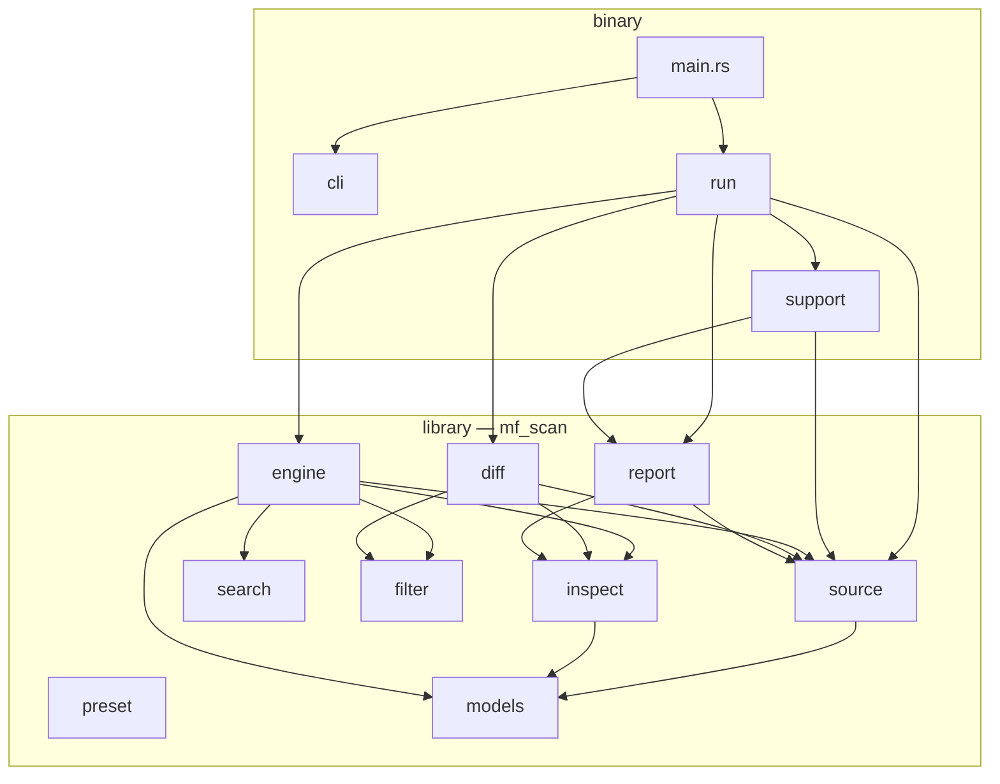
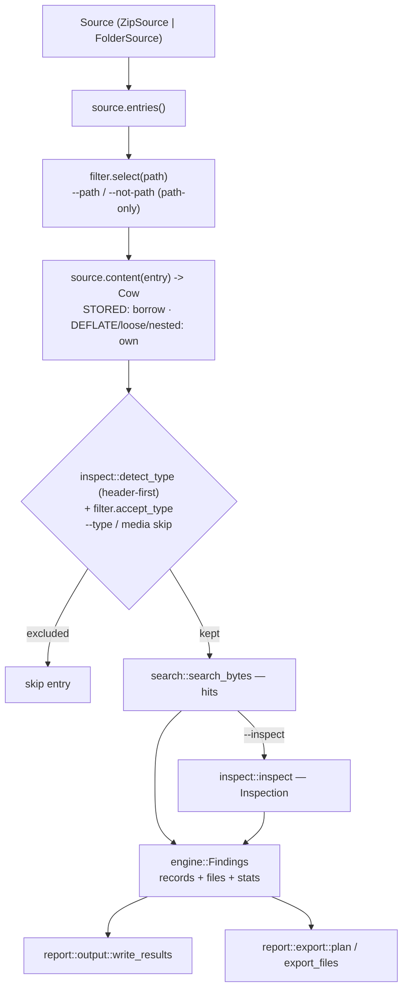

# Architecture

mf-scan is a Rust **library crate** (`mf_scan`) with a thin **binary** on top. All
logic lives in the library so it is unit-testable without the CLI; the binary is only
argument parsing, source resolution, and I/O.

```
src/
  lib.rs        library root (declares the modules below)
  main.rs       BINARY entry point: parse Cli, dispatch Grep | Export | Diff
  cli/          BINARY: clap argument structs, split per subcommand
    mod.rs        Cli + Command enum
    grep.rs export.rs diff.rs   per-subcommand args
    common.rs     shared value types + size parser + the flatten arg-groups
                  (FilterArgs / DecryptArgs / ExportSink) reused by grep & diff
  run/          BINARY: one orchestrator per command (grep.rs / export.rs / diff.rs)
  support/      BINARY: machinery the commands share — sources (resolve operands),
                presets, decryption setup, progress reporter, reporting, exporting

  models.rs     data containers: Method, Entry+Location, SearchHit, MatchRecord,
                Inspection, ContentDiff, RunInfo
  source/       the container abstraction the engine reads through (see ADR 0002)
    mod.rs        Source trait: entries() + content() + byte_size() + integrity_check()
    zip.rs        ZIP central-directory decoders (shared) + ZipSource (mmap,
                  zero-copy STORED; per-entry CRC-32 for export integrity)
    ranged.rs     RangedZipSource: positioned-read ZIP for remote SMB/NFS sources
                  (no whole-file mmap; lazy data-offset resolution; header-first
                  prefix reads). Reuses zip.rs's central-directory decoders.
    folder.rs     FolderSource: a directory of loose files (+ nested-archive arena)
    nested.rs     --archive-depth expansion of nested .zip files into the arena
  sqlite/       low-level SQLite reader (page/record/schema/table), shared by the
                inspector and the backup Manifest.db reader
  ios/          iOS-specific layers
    containers.rs GUID→bundle-id container annotation
    backup/       iTunes/Finder backup → logical domain/relativePath view:
                  profile (recognise), manifest (MBFile decode), password
                  (provenance), common (shared Files-table walk, blob locating,
                  missing-file count, SHA-1 digest check), keybag + keys
                  (KDF/unwrap/CBC, encrypted only)
      source/     BackupSource enum (build/record + Source dispatch) over its two
                  variants: encrypted::EncryptedBackupSource (decrypts lazily),
                  plain::PlainBackupSource (unencrypted, no crypto)
  search/       per-entry byte search: scan.rs (regex + line preview)
  engine/       orchestration: search_source over a Source -> Findings
    mod.rs        drivers + Findings/Query/Progress; classify.rs is the per-entry body
  filter.rs     EntryFilter: path globs (--path/--not-path) + --type / media skip
  diff/         compare two Sources -> DiffReport (mod.rs) using compare.rs (meta|hash)
  preset/       behaviour presets behind one flag; fast.rs is the --fast exclude list
  inspect/      "what does this match mean" inspectors + file-type detection + diff
    mod.rs        Inspector trait (detect/inspect/diff) + registry + detect_type
    txt.rs json.rs xml.rs csv.rs plist.rs sqlite.rs   (resolve offsets; some diff)
    value_diff.rs  shared JSON-tree diff used by json + plist
    media/        the `media` category (classification only)
  report/       output.rs (matches txt/json/csv) · stats.rs · export.rs (copy +
                stored-digest integrity) · diff.rs
```

## Module dependencies

The binary layer (`main`/`cli`/`run`/`support`) depends on the library; within the
library, `engine` and `diff` read through the `source` abstraction, and every data type
bottoms out in `models`.



## Data flow (grep)

Entries come from a `Source` (a ZIP archive or a folder); they are selected first
(path-only filter), then searched in parallel (rayon, one task per entry).



`engine::search_source` produces **both** `records` (one `MatchRecord` per match) and
`files` (one `MatchedFile` per matched file, de-duplicated for export) in a single pass,
so printing and exporting never re-scan. `diff::diff_sources` runs the analogous flow
over two sources, pairing entries by path (see [diff.md](diff.md)).

## Why these choices

- **The `Source` trait.** The engine used to assume every source was a memory-mapped ZIP
  addressed by byte offsets. A trait with `content() -> Cow` lets folders and nested
  archives flow through the same search/inspect/export pipeline; the offset model becomes
  `Option` where there is no archive byte. See [ADR 0002](adr/0002-source-container-abstraction.md).
- **CD-first ZIP parsing.** The Central Directory is the authoritative list of entries;
  the true data offset is resolved from each Local File Header (whose name/extra lengths
  may differ from the CD's — a classic pitfall).
- **mmap + `regex::bytes`.** STORED data is uncompressed on disk, so a memory-mapped SIMD
  byte-regex runs with no copy. Matching is on `&[u8]`, never `&str` — forensic data is
  arbitrary bytes.
- **Parallelism via rayon.** Entries are searched in parallel; `collect` preserves order,
  so output is deterministic.
- **Library has no UI.** `engine::Progress` is a trait the engine calls; the terminal
  reporter lives in `support`. `report::output::OutputFormat` parses via `FromStr`, so the
  core never depends on clap.
- **Inspectors are a small API, reused for four jobs.** Each format is an `Inspector`:
  `detect` (header), `inspect` (resolve an offset), optional `diff` (intra-file diff for
  `diff --inspect`), and optional `sidecars`. The same registry powers deep inspection,
  `--type`/media filtering (`detect_type`), BLOB classification inside SQLite, and the
  diff — a format is described once. Adding one is a new submodule plus a line in
  `INSPECTORS`.
- **Errors, not panics.** All parsing uses bounds-checked reads returning `Result`;
  anything an inspector can't resolve degrades gracefully (forensic inputs are partial).

## Key types (`models.rs`)

- `Method` — `Stored` or `Deflate`.
- `Location` — where a file's bytes live: `Zip { … }` (mmap offsets), `Loose { path }`
  (disk), or `Nested { archive, … }` (offsets into a folder source's in-memory arena).
- `Entry` — a located file: `name`, `uncompressed_size`, `mtime` (for diff), `location`.
- `SearchHit` — one match within an entry: `offset`, line-preview bytes, match range.
- `MatchRecord` — an archive-level match. `archive_offset` is `Option<u64>` — `None` for a
  loose/nested/DEFLATE/decrypted match. `MatchRecord::new` is the single home of the
  offset rule.
- `Inspection` / `ContentDiff` — `{ format, summary, detail }`: a human one-liner plus a
  structured JSON value, for `--inspect` and `diff --inspect` respectively.

## Testing

Tests live in `tests/` (integration) and inline `#[cfg(test)]` modules (unit), using the
library directly — the CLI is exercised manually, not by tests, so CLI changes don't churn
them. ZIP fixtures are **hand-built byte by byte** (`tests/common`) so they are
deterministic and need no external `zip` tool; binary-format inspectors and the SQLite diff
are tested against committed real fixtures (`tests/fixtures/`).

`cargo test` runs the full suite (lib unit + integration);
`cargo clippy --all-targets` and `cargo fmt --all -- --check` are clean.

## Local checks (run before pushing a tag)

The release gate (`.github/workflows/release.yml`, `check` job) runs `cargo fmt --check`,
`cargo clippy --all-targets --locked -- -D warnings`, and `cargo test --all --locked`, then
builds four targets. **Mirror it locally with `./scripts/check.sh`** — don't just run plain
`cargo clippy`.

Why the script and not bare `cargo clippy`: CI runs clippy on a **Linux** runner, so it
compiles the `#[cfg(target_os = "linux")]` paths (e.g. `is_remote_path`'s `statfs` magic in
`support/sources.rs`). On a macOS dev box `cargo clippy` compiles the **macOS** branch
instead, so a Linux-only lint or build error passes locally and only fails in CI. The script
runs clippy for every release target (`x86_64-unknown-linux-gnu`, `x86_64-pc-windows-msvc`,
plus the host), so `cfg`-gated code is linted before the tag goes up. Clippy/check don't
link, so cross-target runs need only the target's std — install once:

```
rustup target add x86_64-unknown-linux-gnu x86_64-pc-windows-msvc
```

Missing targets are reported (with the `rustup` command) and skipped, so the script still
runs what it can. **When touching `#[cfg(...)]` code, the cross-target run is the one that
matters** — that is the class of bug bare local clippy cannot see.

## Releasing

Releases are **tag-driven** — there is no manual changelog or upload step. To cut `vX.Y.Z`:

1. `./scripts/check.sh` — green across all targets (above).
2. Bump `version` in `Cargo.toml`, then refresh the lockfile: `cargo update -p mf-scan --precise X.Y.Z`. Commit both (`--locked` CI builds require `Cargo.lock` to match).
3. `git push origin main`, then tag and push: `git tag -a vX.Y.Z -m vX.Y.Z && git push origin vX.Y.Z`.

Pushing the tag re-runs the gate, builds linux/windows/macOS (x86_64 + aarch64) archives
(binary + README + LICENSE + `presets/`), computes `SHA256SUMS`, and publishes a GitHub
Release with notes auto-generated from the commits since the previous tag.

**Tags are immutable — never force-move a pushed tag.** If a tagged build fails CI (so no
release was published), fix forward with the next patch version (e.g. `v0.3.0` failed →
ship `v0.3.1`) rather than re-pointing the tag; an already-fetched tag must never change
its target. A dead tag with no release is harmless, but can be removed with
`git push origin :refs/tags/vX.Y.Z`.

## Benchmarking

`benchmark/io_bench.py` compares the `mmap` and `ranged` I/O modes on one archive or folder
(wall time, the user/sys CPU split, RSS, page faults, and the `--verify` capability), and is
the tool to re-run when changing anything in the read path. See [benchmark/README.md](../benchmark/README.md)
for scenarios and the current findings (why `mmap` is the default and when to reach for
`--io-mode ranged`).
