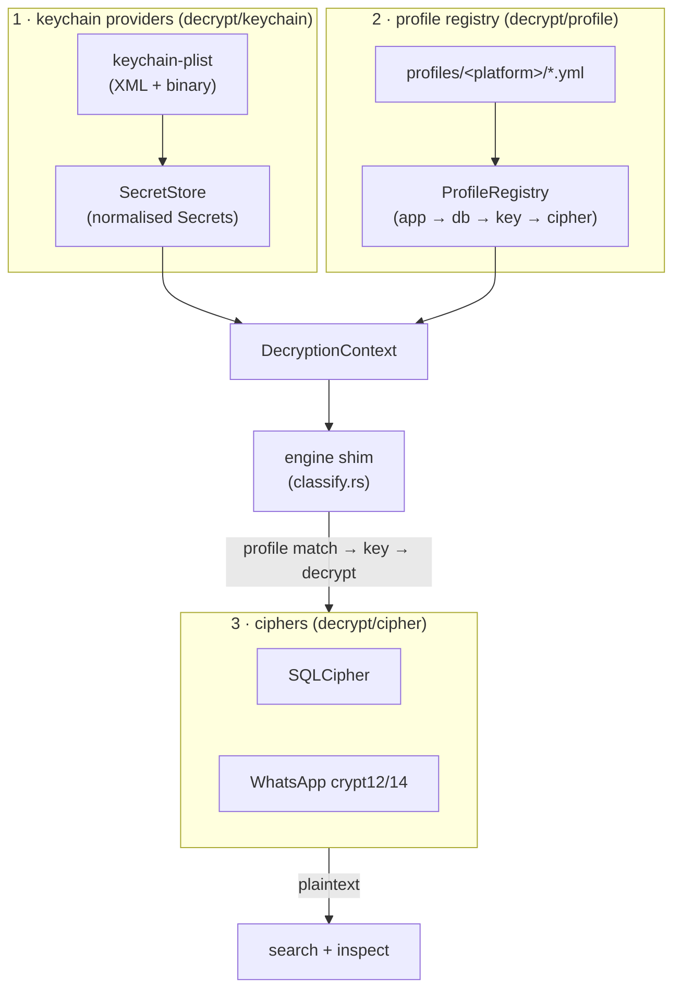
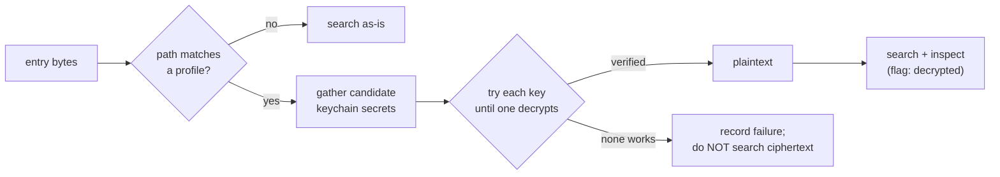

# Database decryption

`mf-scan` can decrypt encrypted app databases inside an acquisition ZIP using
keys from a keychain/keystore dump, then search and `--inspect` the **plaintext** —
so a Signal or SQLCipher database is searched as if it were never encrypted.

This document describes the design, the supported formats, the profile schema, the
provenance it records, and — importantly — what is and is not validated.

---

## Scope and the hard constraint

Decryption only works on acquisitions whose **keychain/keystore has already been
decrypted** by the acquisition tool (a full-file-system dump from GrayKey,
Cellebrite, a `checkm8`/jailbreak extraction, etc., which emits a decrypted
`keychain.plist`/JSON).

You **cannot** decrypt a raw on-device `keychain-2.db` offline: its items are
wrapped by the Secure Enclave / device UID key, which never leaves the device. So
`mf-scan` *consumes* an already-decrypted keychain dump — it does not break the
keychain itself.

---

## Architecture — three decoupled layers + an engine shim



Each layer is independent, so the framework is *scheme-agnostic*:

1. **Keychain providers** (`src/decrypt/keychain/`) normalise any dump format into a
   `SecretStore` of `Secret`s (the standard iOS SecItem attributes: `acct`, `svc`,
   `agrp`, `labl`, `pdmn`, `v_Data`). Adding a source = adding one
   `KeychainProvider`. Today: `keychain-plist` (XML **and** binary plist, via the
   pure-Rust `plist` crate) — covers iLEAPP, GrayKey, and any standard SecItem
   export.
2. **Profile registry** (`src/decrypt/profile.rs`) loads per-app YAML from
   `profiles/{ios,android}/*.yml`. A profile names the database, how to locate its
   key in the dump, and the cipher. Adding a target = adding one file.
3. **Ciphers** (`src/decrypt/cipher/`) implement the `DbDecryptor` trait, one per
   scheme. Today: **SQLCipher** and **WhatsApp crypt12/14**.

The **engine shim** (`src/engine/classify.rs`) consults the `DecryptionContext`
once per entry: if a profile matches the entry's path, it tries each candidate key
until one decrypts, then hands the plaintext to the normal search/inspect pipeline.

---

## Per-entry pipeline



The **try-each-candidate** loop is what gives forensic robustness: a profile's
match criteria may select several keychain items, so each is tried until one
decrypts and (where the cipher supports it) cryptographically verifies. A
profile-matched entry that cannot be decrypted is **recorded as a failure and not
searched** — its ciphertext holds no meaningful content.

Matches found in decrypted content are flagged `decrypted` in the output (txt
`[decrypted]`, a `decrypted` field in JSON/CSV); their offsets are positions in the
*plaintext*, so the archive byte offset is set to the entry's data start (as for
DEFLATE).

---

## Keychain sources and auto-detection

Keys come from:

- **A dump beside the archive** — by default, `mf-scan` scans the archive's
  directory for a `keychain`-named dump (the common forensic layout: `case.zip`
  next to `keychain.plist`). This is the usual path; no flag needed.
- **`--keyfile FILE`** — point at a dump explicitly (repeatable). A parse failure
  here is reported (you named the file); auto-detected non-matches are silent.
- **`--no-decrypt`** disables both.

Decryption is **on by default** when a dump is present. `--platform ios|android`
limits which profiles are considered.

---

## Profile schema

```yaml
name: signal-ios            # stable id (used in provenance)
app: Signal                 # display name
platform: ios               # ios | android — must match the folder
description: ...

db:                         # exactly one of:
  glob: "*/grdb/signal.sqlite"   # wildcard (*, ?), any depth
# path: "App/db.sqlite"          # exact internal path

key:
  encoding: raw             # raw | hex | base64 | passphrase
  keychain:                 # locate the key in the dump (each field optional = wildcard)
    service: TSKeyChainService
    account: OWSDatabaseCipherKeySpec

cipher:
  algorithm: sqlcipher      # see "Ciphers" below
  # …scheme-specific knobs…
```

Platform is both the folder **and** an in-file field; the loader rejects a profile
filed under the wrong platform folder. Files starting with `_` (and top-level
files like `profiles/_example.yml`) are treated as templates and skipped.

See `profiles/_example.yml` for the fully-annotated template.

---

## Ciphers

### SQLCipher (`algorithm: sqlcipher`)

Page-based AES-256-CBC with a per-page HMAC. Knobs (defaults follow SQLCipher 4):

| key | default | notes |
|---|---|---|
| `page_size` | 4096 | |
| `kdf_iter` | 256000 | SQLCipher 3 = 64000 |
| `hmac` | sha512 | sha1 / sha256 / sha512 (v3 = sha1) |
| `kdf` | sha512 | KDF PRF hash |
| `use_hmac` | true | |
| `plaintext_header_size` | 0 | cleartext prefix before the cipher data (not yet supported if > 0) |

Key derivation: `key = PBKDF2(passphrase, file-salt, kdf_iter)`; a raw key is used
directly (a 48-byte raw key is `key‖salt`, the Signal keyspec form). The HMAC key is
`PBKDF2(key, salt⊕0x3a, 2)`. Page-1 HMAC verifies the key (a mismatch is treated as
a *wrong key*); the result's `verified` flag reflects this.

### WhatsApp crypt12/14 (`algorithm: whatsapp-crypt`)

AES-256-GCM over a zlib-compressed SQLite database. Knobs:

| key | default | notes |
|---|---|---|
| `iv_offsets` | `[8, 51, 67, 191]` | candidate 16-byte IV offsets |
| `zlib` | true | inflate the decrypted payload |

The crypt14 header is a variable-length protobuf, so the IV offset is not fixed.
Rather than parse the protobuf, the decryptor **tries each candidate IV offset and
relies on the GCM authentication tag** to confirm the right one (a false accept is
~2⁻¹²⁸). That GCM verification is the `verified` flag. Key derivation is WhatsApp's
"backup encryption" HKDF-SHA256 over the key material.

---

## Provenance (chain of custody)

Every decryption attempt is recorded:

- **stderr summary** — a `── decryption ──` block: per database, decrypted (with the
  key's service/account/source) or failed (with the reason).
- **Scan report** (`*-report.json`) — a `decryptions[]` array with, per entry: the
  profile, app, `verified` flag, the secret's source/service/account, and the
  **SHA-256 of both the ciphertext and the plaintext** (attesting exactly which
  encrypted bytes became which plaintext). `RunInfo` also records the `keychains`
  used and the `platform`.

---

## CLI examples

```bash
# Keychain dump sits next to the archive — auto-detected, nothing to configure:
mf-scan grep "needle" case.zip

# Point at a dump explicitly, scope to iOS profiles:
mf-scan grep "token" case.zip --keyfile keychain.plist --platform ios

# Plain grep, no decryption:
mf-scan grep "needle" case.zip --no-decrypt
```

---

## ⚠ Validation status

The cryptographic assembly is covered by encrypt↔decrypt round-trip, tamper, and
wrong-key tests, but **neither cipher has been validated against output from the
real tool** (no `sqlcipher` binary / WhatsApp backup was available during
development). Before relying on a decryption forensically:

- **SQLCipher**: generate a database with the real `sqlcipher` CLI (known key +
  known content) and confirm `mf-scan` recovers it. The page-number is HMAC'd
  little-endian (the de-facto convention) — a real fixture would confirm that.
- **WhatsApp crypt14**: confirm against a genuine `.crypt14` + `key` file.

Known gaps / follow-ups:

- **WhatsApp key sourcing.** On Android the key is the `key` *file* in the
  acquisition filesystem, not a keystore dump — so the WhatsApp profile needs that
  file's bytes placed into the supplied dump until a "key from an archive file"
  provider is added.
- **crypt15** (64-digit passphrase) is not implemented.
- **Cellebrite-specific** keychain exports that differ from the standard SecItem
  plist need a real sample to add a dedicated provider.
- **Shipped profile identifiers** (e.g. Signal's keychain service/account) are the
  commonly documented values and carry `⚠ verify` notes — confirm against the
  build under examination.

---

## Extending

| To add… | Do this |
|---|---|
| a **new app** | add `profiles/<platform>/<app>.yml` (no code) |
| a **keychain dump format** | add a `KeychainProvider` in `src/decrypt/keychain/` and register it |
| a **cipher** | add a `DbDecryptor` in `src/decrypt/cipher/` + a `CipherSpec` variant + one dispatch arm |
