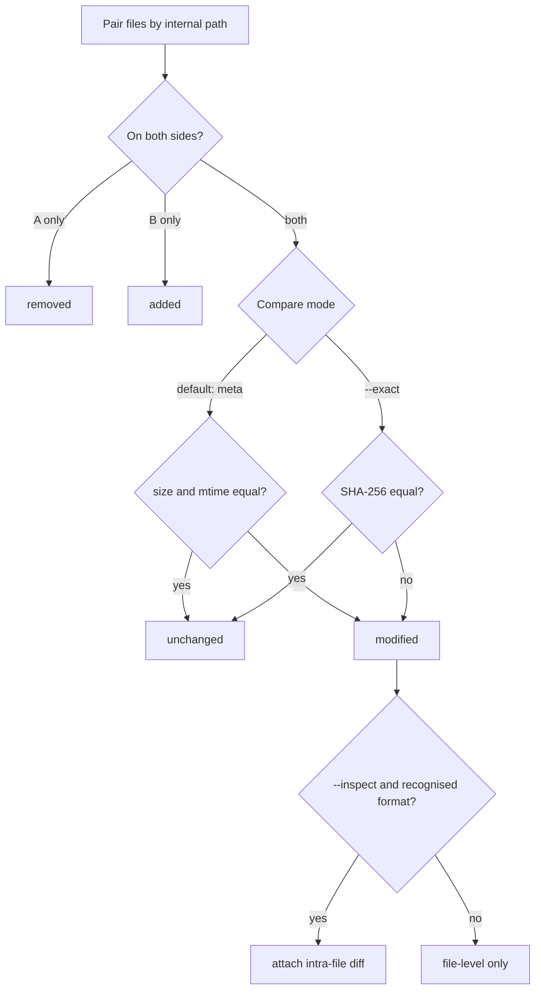

# `mf-scan diff` — comparing two sources

`mf-scan diff A B` compares two acquisitions — two archives, two folders, or one of
each — and reports which files changed. It answers the forensic question *"what is
different between these two captures?"* without extracting either one.

Each side is a single [source](architecture.md#sources): a `.zip` file, or a directory
read with `--dir-mode` (and, with `--archive-depth`, the archives nested inside it).
There is no `-r` (archive-harvesting) mode for a diff side — a side is one source, not
a harvested set; a directory side without `--dir-mode` is rejected.

## What it reports

Files are paired by their **internal path** and each is classified:

| Verdict | Meaning |
|---|---|
| `added` | Present in **B** only. |
| `removed` | Present in **A** only. |
| `modified` | Present in both, but different. |
| `unchanged` | Present in both and the same. |

"A" is the baseline (the first operand), "B" the comparison (the second).

## How "modified" is decided



- **Default — metadata:** two files are *unchanged* when they have the same size **and**
  the same last-modified time. This is fast (no bytes are read) and is the right default
  when both sides come from the same tooling. The timestamp comes from the ZIP
  central-directory DOS field or the filesystem; when neither side records one (some
  ZIP writers store a zero timestamp), the comparison falls back to **size only**.
- **`--exact` — content:** two files are *unchanged* only when their **SHA-256** match.
  Slower (it reads both files) but exact — use it when a content edit could preserve the
  timestamp, or whenever certainty matters more than speed.

## Intra-file diff (`--inspect`)

For a **modified** file of a recognised format, `--inspect` reports *what changed inside*
it, reusing the same inspectors as `grep`:

| Format | Reports |
|---|---|
| SQLite | tables added/removed and per-table **row-count** changes (e.g. `messages 100→103 rows`). Row identity is out of scope; an in-place cell edit with no row-count change is noted as such. |
| JSON | key paths added / removed / changed, e.g. `$.account.token`. |
| plist (XML & binary) | same as JSON, after decoding the property list. |
| text | lines added / removed (a set-level count; pure reordering is reported as no change). |

In txt the intra-file diff appears as an indented `[format] summary` line under the
modified file; in json it is a nested `content` object; in csv it is the `detail` column.

## Output

```
$ mf-scan diff before/ after/ --dir-mode --exact --inspect
~ app/messages.db
    [sqlite] messages 100→103 rows; +1 table(s)
~ config.json
    [json] 1 key(s) added, 0 removed, 1 changed
+ cache/new.bin
- cache/old.bin
3 modified... 1 added, 1 removed, 2 modified, 0 unchanged
```

`-f json` emits `{ summary, files }` with every file's verdict (unchanged included) and
the intra-file `content` where present; `-f csv` emits `path,change,size_a,size_b,detail`.

## Exporting the changes

`diff` reuses `grep`'s export pipeline, so it can persist the **added + modified** files
from side B:

```bash
# Write a manifest of the changed files, then export them with the standard command
mf-scan diff before.zip after.zip --manifest changed.json
mf-scan export after.zip --from-manifest changed.json --to ./delta

# Or export in one step
mf-scan diff before.zip after.zip --export ./delta
```

The manifest is the **same schema** `grep --manifest` writes, so `mf-scan export
--from-manifest` re-ingests a diff result with no special-casing.

## Not yet wired

`diff` rejects rather than silently ignores: `--type`/`--exclude-media` filtering and
decryption-aware diff (`--keyfile`/`--platform`). These are planned; until then a flag
that is parsed but not yet honoured fails loudly.
