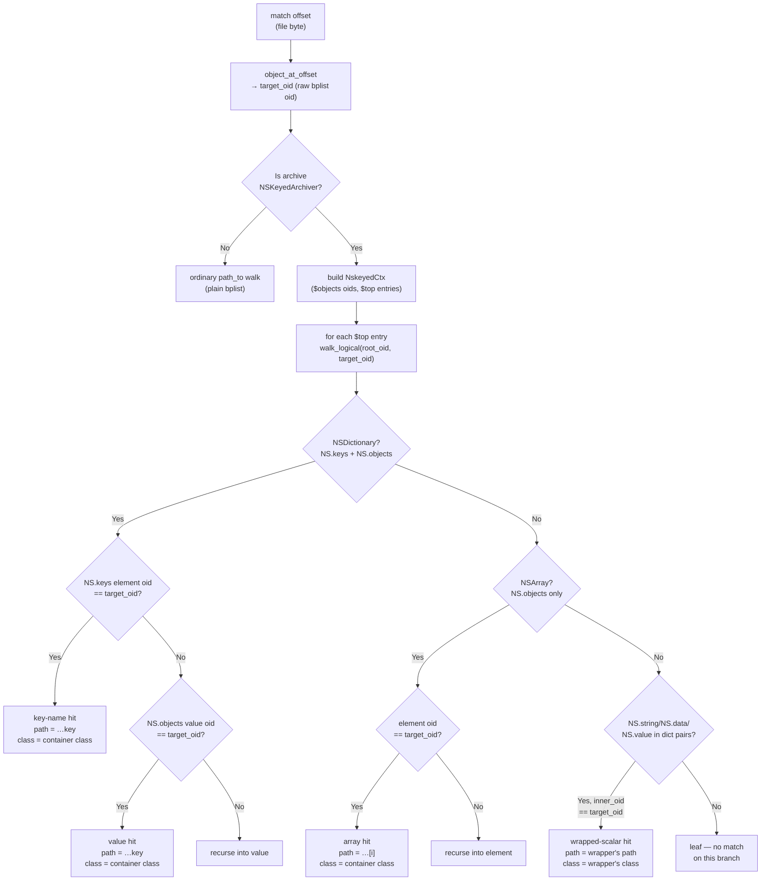

# Inspectors (`--inspect`)

An *inspector* turns a raw match offset into a meaningful location inside a
recognised file format. Inspection is opt-in (`--inspect`) and never changes the
match itself — it only adds `format` + `context` to the output.

## Format detection (header-first)

`inspect::detect` chooses a format using the **content header first**, then the
file extension as a fallback. Forensic file names are often wrong, renamed, or
absent, so a reliable in-content signature is trusted over the extension; the
extension only decides formats that have no magic bytes (JSON, CSV, TXT).

| Detected as | By magic (header) | By extension |
|---|---|---|
| SQLite | `SQLite format 3\0` | `.sqlite .sqlite3 .db .sqlitedb` |
| plist (binary) | `bplist00` | `.plist` |
| plist (XML) | `<?xml …` containing `<plist`/`DOCTYPE plist` | `.plist` |
| XML | `<?xml …` (non-plist) | `.xml` |
| media (image/video/audio) | per-format signatures — JPEG/PNG/GIF/TIFF/HEIF/…, MP4/MOV/MKV/WebM/…, MP3/FLAC/OGG/WAV/… | `.jpg .png … .mp4 … .mp3 …` |
| JSON | — | `.json` |
| CSV | — | `.csv` |
| TXT | — | `.txt .log .text` |
| ABX (Android Binary XML) | `ABX\0` *(coming in a future version)* | `.xml` |
| SEGB (Apple record container) | record-container signature *(coming in a future version)* | — |

A file that matches no inspector is reported as a plain match (no `context`).

## Type and category (`--type`, media skip)

Every inspector also declares a `name()` (its format tag, e.g. `sqlite`, `jpeg`)
and a `category()` (a coarse group: `database`, `structured`, `text`, `media`).
`--type` accepts either, so `--type sqlite` selects one format while `--type
media` selects every image/video/audio format at once. The **media skip** (on by
default, off with `--include-media`) is just this machinery excluding the `media`
category — so there is no separate, duplicated media extension list. Media
inspectors are *classification only*: they recognise the format (so `--type` and
the skip work) but do not resolve an offset, so they add no `context`. They live
in their own category folder `inspect/media/`, one file **per format** (e.g.
`inspect/media/jpeg.rs`), built on the shared `media_inspector!` macro in that
folder's `mod.rs` (the category aggregator). The top-level `inspect/` therefore
holds only file-type inspectors plus the module root.

## What each inspector resolves

### TXT
Counts newlines up to the offset → 1-based **line** and (byte) **column**.

### JSON
A single-pass scanner tracks the path stack and reports the **key path** of the
value (or key) containing the offset, e.g. `$.users[3].token`. (serde gives a
parsed tree but no byte spans, so this is hand-rolled; it locates, it does not
validate.)

### XML
Uses quick-xml's event byte positions to track open elements and reports the
**element path**, e.g. `/plist/dict/string`. Attribute-level resolution is a
future refinement.

### CSV
A quote-aware scan (RFC 4180: `"`-quoted fields, `""` escapes) reports the 1-based
**row** and **column** plus the **header** name (the column's value in row 1).
Commas/newlines inside quotes do not miscount.

### plist (XML and binary)
Both encodings resolve to the same dict-key / array-index **path**, e.g.
`$.Account.Servers[1]`.

- XML plists are walked as XML, tracking `<key>` names and array positions.
- Binary plists (`bplist00`) are parsed via the trailer + offset table: the
  object whose byte span contains the offset is located, then a path to it is
  found by walking the object graph from the root.

#### NSKeyedArchiver serialised plists

Binary plists produced by `NSKeyedArchiver` (the standard Cocoa object-graph
serialiser) store a **flattened `$objects` array** rather than a nested dict tree.
All cross-references are UIDs — integer scalars (bplist marker high-nibble `0x8`)
that are indices into `$objects`. Detection is header-first: the root dict must
contain `$archiver == "NSKeyedArchiver"`.

The resolver (`src/formats/inspect/nskeyed.rs`) walks the UID graph from every `$top`
entry to the object that contains the matched bytes, reconstructing the logical
path (e.g. `$.root.prefs.token`). Four hit kinds are handled:

| Hit kind | Description | Example path |
|---|---|---|
| Direct value | Object is a plain scalar (string, number, data) in an NSDictionary or NSArray | `$.root.title` |
| Array element | Object is an element of an `NS.objects`-encoded NSArray | `$.root.items[2]` |
| Dict key name | The match landed on a dictionary **key** string, not a value | `$.root.NEEDLE_KEY` |
| Wrapped scalar | Object is the inner scalar of a Foundation wrapper (`NS.string` / `NS.data` / `NS.value` field in an `NSMutableString`, `NSData`, or `NSValue` object) | `$.root.s` |

The **Foundation class name** of the logical object that directly holds the matched
value is reported in the `detail` JSON as `"class"` (e.g. `"NSMutableString"`,
`"NSDictionary"`, `"NSArray"`). The field is omitted when the `$class` entry
cannot be read. For a wrapped scalar the class is the *wrapper's* class; for a
container hit it is the *container's* class.

```
detail: {
  "path":     "$.root.prefs.token",
  "archiver": "NSKeyedArchiver",
  "class":    "NSDictionary"        // omitted when unresolvable
}
```

#### NSKeyedArchiver `$objects`/UID resolution — flow



### SQLite
Parses the database header (page size), then the b-tree:

- If the offset lands in a **live table-leaf cell**, it resolves to
  `table + rowid + column` (column names come from the `CREATE TABLE` SQL in the
  schema; the cell's record format gives the column byte spans). The column's
  storage type is shown next to its name — `column: body [TEXT]` — derived from
  the record serial type (`NULL`/`INTEGER`/`REAL`/`TEXT`/`BLOB`).
- When the matched cell is a **BLOB**, its bytes are run back through the same
  header detection: if the blob is itself a recognised format (e.g. a `bplist`
  embedded in a column), that inspector resolves the match inside the blob, and
  the result is attached as `blob_format` + `blob_context` (json) / appended to
  the summary (`… blob: bplist  key: $.Account.Servers`). No SQLite-specific
  format parsing is duplicated — it reuses the inspector registry.
- Otherwise — freelist pages, free blocks, interior/overflow pages, unallocated
  space — it reports just `page` + `offset-in-page`.

This split is intentional: forensically, "which page/offset" is still useful when
a byte isn't part of a current row (e.g. a deleted record in free space).

## The inspector API

Every format is an `Inspector` (the trait in `src/formats/inspect/mod.rs`):

```rust
pub trait Inspector: Sync {
    fn name(&self) -> &'static str;                  // format tag / --type value
    fn category(&self) -> &'static str;              // group, e.g. "media", "database"
    fn extensions(&self) -> &'static [&'static str]; // fallback detection
    fn detect(&self, content: &[u8]) -> bool;        // header/magic (preferred)
    fn inspect(&self, content: &[u8], offset: usize) -> Option<Inspection>;
    fn sidecars(&self) -> &'static [&'static str] { &[] } // associated files
}
```

Inspectors are zero-sized types listed once in `INSPECTORS`. The shared core —
detection order (header-first, then extension), dispatch, and output — lives in
`mod.rs`; an inspector only supplies its format specifics. The per-match
`Inspection { format, summary, detail }` carries the short `format` tag, the
labelled human one-liner (`summary`, used by the txt tag and csv `context`), and
the structured `serde_json::Value` (`detail`, used by json). Shared helpers
(`line_at`, `looks_like_xml`, `contains`) live in `mod.rs` and are documented so
inspectors reuse rather than duplicate them.

### Adding one

1. Copy [`inspector-template.rs`](inspector-template.rs) to
   `src/formats/inspect/<format>.rs` and `mod <format>;` it in `src/formats/inspect/mod.rs`.
2. Fill in `name` / `category` / `extensions` / `detect` / `inspect` (and
   `sidecars` if any). A *classification-only* media format needs no `inspect`
   body — use the `media_inspector!` macro (see `src/formats/inspect/media/jpeg.rs`).
3. Register it: add `&<format>::Foo` to `INSPECTORS` in `src/formats/inspect/mod.rs` —
   **list more specific formats first**, because `detect` (header) checks run in
   order (e.g. plist before generic XML).
4. Reuse shared helpers; add new ones to `mod.rs` with a doc comment.
5. Add a test, ideally against a committed fixture in `tests/fixtures/`.

### Sidecars (associated files)

A format declares the files exported alongside a match via `sidecars()` — suffixes
appended to the file name, e.g. SQLite returns `["-wal", "-shm", "-journal"]`.
`export` fetches them automatically (`inspect::sidecars_for`), so adding a format's
sidecars is one line in its inspector — `export.rs` needs no change.

## Coming in a future version

Two inspectors are designed but not yet implemented, pending representative
sample files to validate the binary parsers against:

- **ABX** (Android Binary XML, e.g. `packages.xml`): magic `ABX\0`, a token
  stream with an interned string pool; resolves to an element path like XML.
- **SEGB** (Apple record container — KnowledgeC, biome, locationd): resolves a
  match to the containing record (index and offset, plus record metadata).

Both slot into the existing inspector framework — one new file each, registered
in `INSPECTORS` — once committed fixtures exist in `tests/fixtures/`.
