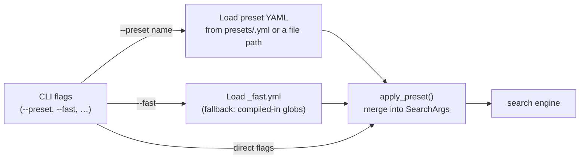

# Presets

A preset is a YAML file that sets default search options. Instead of typing the
same flags every time, save them once in a `.yml` file and load them with
`--preset <name>` (a preset shipped in `presets/`) or `--preset <path>` (any
YAML file on disk).

## Location

The `presets/` directory must sit **in the same folder as the `mf-scan`
binary**. It is shipped alongside the binary in every release archive.

```
mf-scan-macos-aarch64/
├── mf-scan          ← binary
├── presets/
│   ├── _fast.yml       ← built-in preset for --fast
│   └── _example.yml    ← template to copy when creating your own
├── README.md
└── LICENSE
```

## Using a preset

```bash
mf-scan grep PATTERN archive.zip --preset mobile
```

This loads `presets/mobile.yml` and applies its values before your CLI flags.

### By name or by path

The `--preset` argument accepts either form:

| You pass | Resolved as |
|---|---|
| `mobile` | `presets/mobile.yml` next to the binary |
| `./my-preset.yml` | the file at that relative path |
| `/cases/2026/ios.yml` | the file at that absolute path |
| `custom.yaml` | the file `custom.yaml` in the current directory |

The rule: a reference that contains a path separator or ends in `.yml`/`.yaml`
is treated as a **file path**; anything else is a **name** looked up in
`presets/`. This lets you keep a one-off preset alongside a case without copying
it into the binary's `presets/` directory.

## Precedence

CLI flags **always override** preset values.

| Field type | Merge rule |
|---|---|
| Boolean flags | OR — preset can enable a flag; a CLI `true` is never reversed |
| `path`, `not_path`, `file_type` | Both the preset list and the CLI list are applied |
| `threads` | CLI value wins when given; preset fills in if omitted |

## The `--fast` preset (`_fast.yml`)

`--fast` is a shorthand that loads `presets/_fast.yml`. Because it is a regular
YAML file, you can customise it without recompiling — for example, adding noisy
paths to `not_path` once you know what to skip in your target acquisitions.

If `_fast.yml` is missing (e.g. a bare dev build), the tool falls back to its
compiled-in defaults (`exclude_media: true`, no extra path exclusions).

Because `--fast` (and any preset) can exclude whole subtrees, every run is
**transparent about what it skipped**: the active skip rules are logged to stderr
before results, an end-of-run summary reports the scanned/skipped counts and bytes
per rule, and a scan report sidecar (`mf-scan-report.json` by default) records
the same coverage data. See
[Scan statistics & the report sidecar](output-and-offsets.md#scan-statistics--the-report-sidecar).

## Creating a preset

1. Copy `presets/_example.yml` to a new file, e.g. `presets/mobile.yml`.
2. Uncomment and set the fields you want.
3. Run with `--preset mobile`.

## Field reference

All fields are optional. Omit any field to leave the CLI default in place.

| Field | Type | Default | Description |
|---|---|---|---|
| `exclude_media` | bool | false | Skip image, video, and audio files |
| `ignore_case` | bool | false | Case-insensitive regex matching |
| `literal_string` | bool | false | Treat the pattern as a literal string |
| `recursive` | bool | false | Search directories recursively for `*.zip` files |
| `match_path` | bool | false | Match the pattern against entry paths, not content |
| `inspect` | bool | false | Enrich matches with format-specific context (SQLite row, plist key, …) |
| `count` | bool | false | Print match counts per file instead of individual matches |
| `verify` | bool | false | SHA-256 archive integrity attestation (slower) |
| `threads` | integer | (CPU count) | Number of parallel search threads |
| `path` | list of globs | (none) | Only search entries whose internal path matches |
| `not_path` | list of globs | (none) | Skip entries whose internal path matches |
| `file_type` | list of strings | (none) | Only search entries of these types (e.g. `sqlite`, `plist`, `media`) |

### Glob syntax (path / not_path)

Globs are matched against the entry's full internal path:

| Pattern | Meaning |
|---|---|
| `*` | Any sequence of characters, including `/` |
| `?` | Any single character |
| `*/Caches/*` | Any entry with `Caches` as a path segment |
| `*.log` | Any entry whose name ends in `.log` |

### File type values (file_type)

Format names: `sqlite`, `plist`, `jpeg`, `png`, `mp4`, `mov`, `mp3`, `csv`,
`json`, `xml`, `txt`, and others detected by content header.

Category names: `media` (all image/video/audio), `database` (sqlite),
`structured` (plist, json, csv, xml), `text` (txt and similar).

Run `mf-scan grep --type unknown archive.zip` to see the full list.

## Example preset — iOS SQLite focus

```yaml
# presets/ios-sqlite.yml
# Focus on SQLite databases only; skip media and system noise.
exclude_media: true
file_type:
  - sqlite
not_path:
  - "*/Caches/*"
  - "*/tmp/*"
  - "*/System/*"
```

```bash
mf-scan grep "alice@example.com" acquisition.zip --preset ios-sqlite
```

## Workflow diagram


